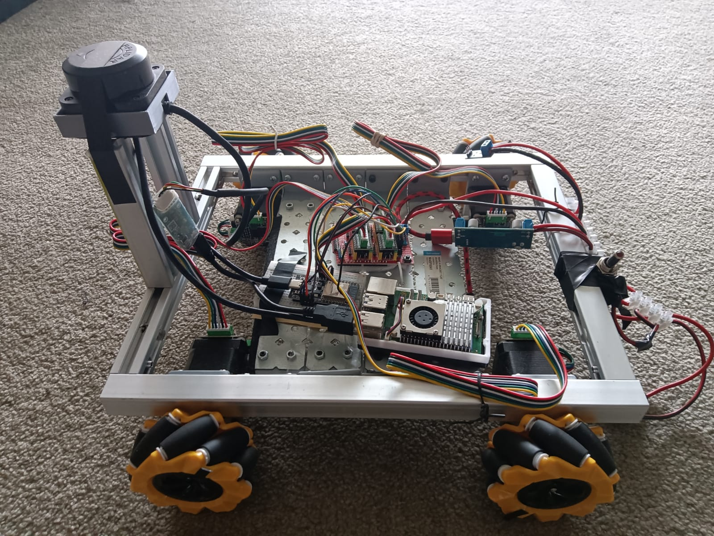

# Requirements
## Jazzy
```bash
sudo apt update && sudo apt upgrade

# Set locale
locale  # check for UTF-8

sudo apt install locales
sudo locale-gen en_US en_US.UTF-8
sudo update-locale LC_ALL=en_US.UTF-8 LANG=en_US.UTF-8
export LANG=en_US.UTF-8

locale  # verify settings

# You will need to add the ROS 2 apt repository to your system.
sudo apt install software-properties-common -y
sudo add-apt-repository universe -y

# Now add the ROS 2 GPG key with apt.
sudo apt update && sudo apt install curl -y
sudo curl -sSL https://raw.githubusercontent.com/ros/rosdistro/master/ros.key -o /usr/share/keyrings/ros-archive-keyring.gpg

# Then add the repository to your sources list.
echo "deb [arch=$(dpkg --print-architecture) signed-by=/usr/share/keyrings/ros-archive-keyring.gpg] http://packages.ros.org/ros2/ubuntu $(. /etc/os-release && echo $UBUNTU_CODENAME) main" | sudo tee /etc/apt/sources.list.d/ros2.list > /dev/null

# Install development tools 
sudo apt update && sudo apt install ros-dev-tools

# Install ROS 2
sudo apt update && sudo apt upgrade && sudo apt install ros-jazzy-desktop -y

sudo tee -a ~/.bashrc <<EOL
export ROS_DOMAIN_ID=0
export QT_QPA_PLATFORM=xcb rviz2
export RMW_IMPLEMENTATION=rmw_cyclonedds_cpp
source /opt/ros/jazzy/setup.bash
source ~/microros_ws/install/local_setup.bash
EOL
source ~/.bashrc
sudo apt-get install python3-rosdep -y
echo ${ROS_DISTRO}
````
## Packages
````bash
sudo apt-get install -y ros-${ROS_DISTRO}-slam-toolbox ros-${ROS_DISTRO}-joint-state-publisher ros-${ROS_DISTRO}-robot-state-publisher ros-${ROS_DISTRO}-xacro
sudo apt install -y ros-${ROS_DISTRO}-ros2-control
sudo apt install -y ros-${ROS_DISTRO}-joint-state-publisher-gui
sudo apt install -y ros-${ROS_DISTRO}-ros2-controllers
sudo apt install -y ros-${ROS_DISTRO}-robot-localization
sudo apt install -y ros-${ROS_DISTRO}-navigation2
sudo apt install -y ros-${ROS_DISTRO}-nav2-bringup
sudo apt install -y ros-${ROS_DISTRO}-controller-manager
sudo apt install -y ros-${ROS_DISTRO}-rosbag2
sudo apt install -y ros-${ROS_DISTRO}-behaviortree-cpp-v3
sudo apt install -y ros-${ROS_DISTRO}-tf-transformations
sudo apt-get install -y ros-${ROS_DISTRO}-image-tools
sudo apt-get install -y ros-${ROS_DISTRO}-cartographer

sudo apt install -y ros-${ROS_DISTRO}-angles
sudo apt install -y ros-${ROS_DISTRO}-mqtt-client
sudo apt install -y ros-${ROS_DISTRO}-launch-xml
sudo apt install -y ros-${ROS_DISTRO}-rmw-cyclonedds-cpp ros-${ROS_DISTRO}-tf2-ros ros-${ROS_DISTRO}-tf2-tools
sudo apt install -y python3-colcon-common-extensions
sudo apt-get install -y ros-${ROS_DISTRO}-rviz2 
sudo apt install -y ros-${ROS_DISTRO}-ros-gz
sudo apt install -y ros-${ROS_DISTRO}-gz-ros2-control
sudo apt install vim -y
sudo usermod -aG dialout ${USER}
````

## microros
https://www.hackster.io/514301/micro-ros-on-esp32-using-arduino-ide-1360ca
````bash
cd ~
mkdir microros_ws
cd microros_ws
git clone -b $ROS_DISTRO https://github.com/micro-ROS/micro_ros_setup.git src/micro_ros_setup
sudo apt update && rosdep update
rosdep install --from-paths src --ignore-src -y
sudo apt-get install -y python3-pip
colcon build
source install/local_setup.bash
ros2 run micro_ros_setup create_agent_ws.sh
ros2 run micro_ros_setup build_agent.sh
````

## ROS Control Determinism
````bash
sudo addgroup realtime && sudo usermod -a -G realtime $(whoami)


sudo tee -a /etc/security/limits.conf <<EOL
@realtime soft rtprio 99
@realtime soft priority 99
@realtime soft memlock 102400
@realtime hard rtprio 99
@realtime hard priority 99
@realtime hard memlock 102400
EOL
````

## Git config and SSH key
````bash
git config --global user.email "omar.gamil.salem@gmail.com"
git config --global user.name "Omar Salem"
ssh-keygen -t ed25519 -C "omar.gamil.salem@gmail.com"
cat ~/.ssh/id_ed25519.pub
````

## Create workspace and clone repo
````bash
mkdir -p ~/ugv_ws/src
cd ~/ugv_ws/src 
git clone git@github.com:Omar-Salem/ugv.git .
cd ~/ugv_ws
colcon build 
````

## Shutdown shortcut
````bash
echo "alias off='sudo shutdown -h now'" >> ~/.bash_aliases
````

## Run
### Display

```bash
cd ~/ugv_ws && colcon build --packages-select ugv_description && source install/setup.bash && ros2 launch ugv_description display.launch.py use_joint_state_publisher:=True
```

### Control
```bash
cd ~/ugv_ws && colcon build --packages-select ugv_control && source install/setup.bash && ros2 launch ugv_control gazebo.launch.py
```

### Mapping
```bash
cd ~/ugv_ws && colcon build --packages-select ugv_mapping && source install/setup.bash && ros2 launch ugv_mapping gazebo.launch.py
```

### Navigation
```bash
cd ~/ugv_ws && colcon build --packages-select ugv_nav && source install/setup.bash && ros2 launch ugv_nav gazebo.launch.py
```


